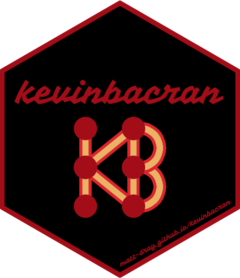

# kevinbacran: Degrees of Separation Between CRAN authors




_This package is in development._

## What?

How separated are authors on the Comprehensive R Archive Network (CRAN), the home of R packages?

The aim is to provide some functions to approximate an implementation of [The Six Degrees of Kevin Bacon](https://en.wikipedia.org/wiki/Six_Degrees_of_Kevin_Bacon), or [Erdos Numbers](https://en.wikipedia.org/wiki/Erd%C5%91s_number) and [variants](https://www.timeshighereducation.com/blog/whats-your-erdos-bacon-sabbath-number).

## Installation

Install this development version with `remotes::install_github("matt-dray/kevinbacran")`.

## How do?

```
library(kevinbacran)

# Get CRAN data and turn into tidygraph of authors 
# (nodes) and packages (edges)
combo_graph <- kb_combos()

# Get subset of CRAN tidygraph composed of named authors
# plus the packages and authors that connect them
pair_graph <- kb_pair(combo_graph, "Yihui Xie", "Garrett Grolemund")

# Print distance value between named authors
kb_distance(pair_graph)

# Plot network graph of authors and packages
# Named authors are terminals
kb_plot(pair_graph)
```
